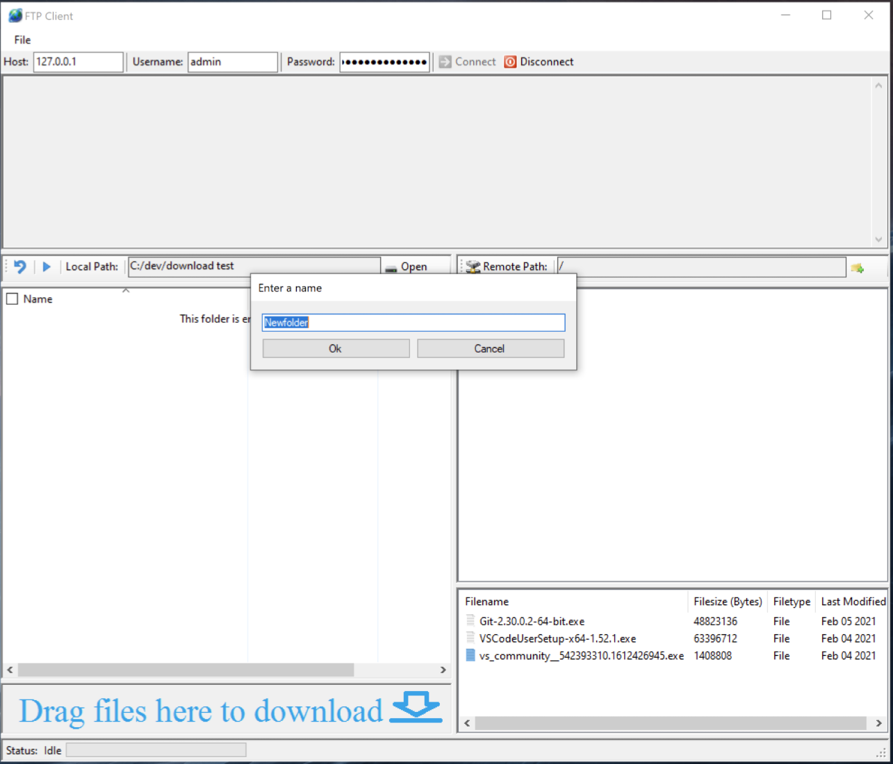

# C# FTP Cient
This is the client part of a simple C# based FTP Server/Client project. FTP operations are done using the FTPWebRequest and FTPWebResponse classes and connections are not encrytped. Currently does not support trasnfering more than one file simultaneously.

[C# FTP Server](https://github.com/DAVRUS06/C-Sharp-FTP-Server) is the server side of this project.

# Sections
* [GUI Overlook](#GUI-Overlook)
  * [Zone 1](#Zone-1)
  * [Zone 2](#Zone-2)
  * [Zone 3](#Zone-3)
  * [Zone 4](#Zone-4)
  * [Zone 5](#Zone-5)
  * [Zone 6](#Zone-6)
  * [Zone 7](#Zone-7)
  * [Zone 8](#Zone-8)
* [Using the Client](#Using-the-Client)
  * [Connecting to the Server](#Connecting-to-the-Server)
  * [Disconnecting from the Server](#Disconnecting-from-the-Server)
  * [Creating a New Folder](#Creating-a-New-Folder)
  * [Renaming a File/Folder](#Renaming-a-File/Folder)
  * [Download a File](#Download-a-File)
  * [Upload a File](#Upload-a-File)
  * [Deleting a File/Folder](#Deleting-a-File/Folder)
  

# GUI Overlook
The GUI is built using Windows Form, the main window has been broken into 8 zones to make describing them easier.
##### Figure 1: Client Opened

## Zone 1 
This is where the host, username and password textboxes. These are used to type in the host IP address to connect to as well as the username and password for authentication. The connect and disconnect button are also in this zone. 

## Zone 2
This is where all the logging of operations will be done. Whenever any operation is performed the command sent to the server as well as the response from the server will be displayed in this zone. 

## Zone 3
This section was implemented to make selecting a folder on the local filesystem easier. The back button will return to the previous folder and the forward will do the opposite. It shows the local path that is being viewed and gives a button to open a folder easily instead of clicking through the directories below. 

## Zone 4
This section is a WebBrowser viewing the local file system of the computer. It defaults to C drive of the PC. It will show the files of the current directory on the local system.

## Zone 5
This section is where the remote filesystem will be displayed as a tree of folders. At the top of this zone is the remote path of the server and to the right of the path is a button that is used to created new folders on the server.

## Zone 6
This section displayed the contents of the selected folder in Zone 5. The filename, size, type and last modified is shown for each file. This is also the section where the user will be able to rename, delete, create folders and download files from. The user can also drag & drop files from the local system into this zone to upload to the server.

## Zone 7
This section is from dragging and dropping to download from the server since the WebBrowser used in zone 4 didn't support the operation.

## Zone 8
Shows status of the current operation. While a transfer is being done a progress bar will be shown.

# Using the Client

## **Connecting to the Server**
To connect to the FTP server all that needs to be done is supplying the IP address of the server in the host textbox. Then type in the username and password for authenticating with the server and hit the connect button. As of right now the client does give the ability to switch the port so it defaults to the FTP port 21. 
##### Figure 2: Client Connected

## **Disconnecting from the Server**
To disconnect simply press the disconnect button and the client will send the necessary command to stop and disconnect from the server.

## **Creating a New Folder**
Right click in the bottom right section that displays the files on the remote sytstem. This will bring up the menu shown below in figure 3.

##### Figure 3: Creating a New Folder

Selecting the "Create New Folder" option will bring up a window to type in a name for the folder shown below in figure 4.

##### Figure 4: Creating a New Folder - Naming Folder

Type in the name and then select ok to finalize the creation of the new folder or select cancle to stop the creation of the new folder. If ok is selected then the new folder will be created on the remote system shown in figure 5.

##### Figure 5: Creating a New Folder - Folder created

## **Renaming a File/Folder**

Simlar to creating a folder, right click in the bottom right section that shows the files on the remote system.

##### Figure 6: Renaming a File/Folder

Select rename for the rename window to pop up.

##### Figure 7: Renaming a File/Folder - New Name

Type in the new name and select ok to finalize the new name of the file/folder or select cancel to stop the renaming operation. If ok is selected then the new name will be shown.

##### Figure 8: Renaming a File/Folder - Completed

## **Download a File**
Right click a file in the remote system view to show the menu. 

##### Figure 9: Downloading a File

Select the download option to download the file. The file will start downloading and a progress bar will be shown at the bottom.

Another option is to instead drag and drop the file into the specified area in the GUi. This will also initiate a download of the dragged file.

## **Upload a File**
To upload a file just drag and drop the file from the local file system to the remote file view in the bottom right of the GUI. This will upload the file to the remote server. Just like the download a progress bar will be shown in the bottom of the window to show the transfer.

##### Figure 10: Uploading a File

## **Deleting a File/Folder**
To delete a file or folder right click the file in the remote system view in the bottom right. The menu will be displayed.

##### Figure 11: Deleting a File/Folder

Select delete to delete the file or folder that was right clicked. If it is a folder then the folder needs to be empty before deleting it.
